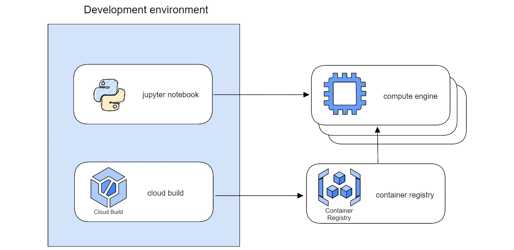

# Parallel engine

Parallel engine is a simplistic Virtual machine launcher for data science jobs
It allows to parallelize docker images over several machines


## MVP Architecture


## Google cloud authentication

Run the following command to connect to GCP. If you are running the command on a local machine, make sure you've installed the [google cloud CLI](https://cloud.google.com/sdk/docs/install)

```sh
    gcloud auth application-default login
    gcloud auth login
```

Follow the instructions and login to your GCP project

## Cloud build push docker image

Cloud Build is used to push the docker image in Google Container Registry.
Run the following command to push the docker image to gcr

```sh
gcloud builds submit \
--project <my_project>
```

set environment variables
```
export PROJECT_ID = my_project
```

```
docker-credential-gcr configure-docker 
docker run <image uri> --project <my_project> --dataset <my_dataset>
#TODO remove 
docker run gcr.io/io-leroy-merlin-mmm/job-runner:latest --project io-leroy-merlin-mmm --dataset test
```


create the network 
```
gcloud compute networks create default-vm --subnet-mode automatic
```