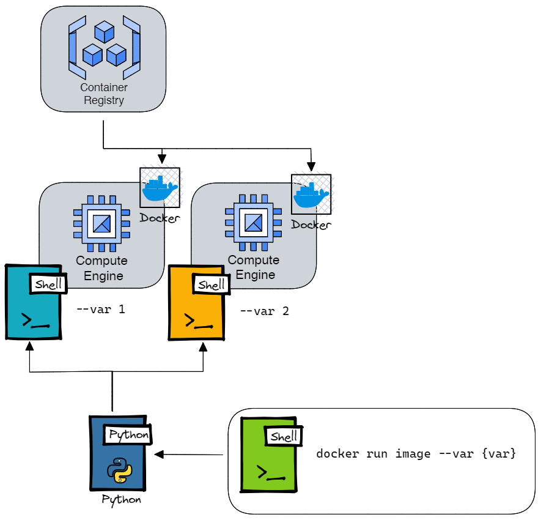

# Parallel engine

Parallel engine is a simplistic Virtual machine launcher for data science jobs.
It allows to parallelize docker images over several machines


## MVP Architecture


## Google cloud authentication

Run the following command to connect to GCP. If you are running the command on a local machine, make sure you've installed the [google cloud CLI](https://cloud.google.com/sdk/docs/install)

```sh
    gcloud auth application-default login
    gcloud auth login
```

Follow the instructions and login to your GCP project


## Cloud build push docker image

### Set up the Dockerfile
Please follow the provided test Dockerfile located in code directory as a template.

1. Copy and paste the content of your code into the code folder (make sur the Dockerfile can be located at the root of the code directory)
2. The `ENTRYPOINT` is directed to `main.py` file which contains an argument parser.
3. In order to include variabilization, parallel-engine will send arguments to the `main.py` through the docker run command. Make sure you've defined all the necessary arguments from the `main.py` file before building the Docker image
4. Update the docker run command located in `startup-script.sh` accordingly

Here is an example:
If your main.py file contains 3 arguments (--dataset, --project, and --var)
```sh
docker run my_image --dataset {my_dataset} --project {my_project} --var {my_var}

```
5. These arguments are still variables (`{argument}`) at this step, but they will be replaced when starting each machine from the notebook


### Push the docker image to gcr
Cloud Build is used to push the docker image in Google Container Registry.

From the parallel-engine directory, run the following command to push the docker image to gcr

```sh
gcloud builds submit \
--project ${PROJECT_ID}
```
## Set up the environment variables

Make sure you've created a `.config.yaml` file in the root directory of parallel-engine
This yaml file shoud at least contain the folowing values
```yaml
PROJECT_ID: py-project
ZONE: europe-west1-b
MACHINE_TYPE: n1-standard-1
VM_QUOTAS: 64
NETWORK: default
SERVICE_ACCOUNT: service-account@project.iam.gserviceaccount.com
```

## Run the paralelized docker image

### Install all the python dependencies on your local environment

```sh
pip install -r requirements.txt
```

## Start compute engines with specific parameters
Once everything is set up, run the runner.ipynb notebook to paralellize your image on several machines
Adapt the "Run parallel workers" step to loop on your paramers. The parameters will be replaced in the startup_script of each worker.

make sure you have sufficient level of access in your GCP project in order to start VMs.


## Local debbuging
To check if your docker image works properly, run the following command in google cloud CLI

```sh
docker-credential-gcr configure-docker 
docker run ${IMAGE_URI} --project ${PROJECT_ID} --dataset ${DATASET}
```
